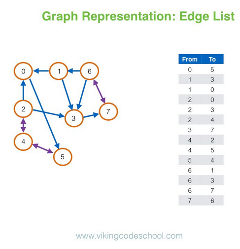

## Graph Representation

[Graph](https://en.wikipedia.org/wiki/Graph_(abstract_data_type)) is an abstract data type, structured with vertex/node and edge. Here is a simple example:


A directed graph with three vertices (blue circle) and three edges (black arrows)

Graph could be represented in many ways in programming, here are some of the most common ways.

### Adjacency Matrix

The adjacency matrix, sometimes also called the connection matrix, of a simple labeled graph is a matrix with rows and columns labeled by graph vertices, with a $1$ or $0$ in position $(v_i,v_j)$ according to whether $v_i$ and $v_j$ are adjacent or not.


If the graph has a weight, than you can simply change $1$ in the matrix with it's weight, and if for some $v_i$ and $v_j$ there isn't any edge, you can store it as $-1$ or $\infty$.

In C++, we can use $\text{2D}$ array, or a $\text{2D}$ vector to store this:

```c++
int n; // number of nodes
cin >> n;
vector<vector<int>> matrix(n, vector<int>(n));
for (int i = 0; i < n; i++) {
    for (int j = 0; j < n; j++) {
        int value;
        cin >> value;
        matrix[i][j] = value;
    }
}
```

This represantion obviously takes $O(V^2)$ memory, where $V$ is the number of node, and because of that, this isn't good representation, but it's useful for small graphs.

### Edge List

An edge list is a data structure used to represent a graph as a list of its edges. An (unweighted) edge is defined by its start and end vertex, so each edge may be represented by two numbers.



In C++, we can store this simply with a list of pair:

```c++
int m; // number of edges
cin >> m;
vector<pair<int, int>> edges;
for (int i = 0; i < m; i++) {
    int u, v;
    cin >> u >> v;
    edges.push_back(make_pair(u, v));
}
```

This representation takes $O(E)$ memory, where $E$ is the number of edge. This representation is usually used for finding [Minimum Spanning Tree](https://cp-algorithms.com/graph/mst_kruskal.html).

### Adjacency List

In graph theory and computer science, an adjacency list is a collection of unordered lists used to represent a finite graph. Each list describes the set of neighbors of a vertex in the graph. This is one of several commonly used representations of graphs for use in computer programs.


This graph representation is often used in CP, mainly because it's easy to do traversal in the graph with this representation.

In C++ you can store it with an array of vectors:

```c++

const int N = number_of_nodes;

vector<int> adj[N];
int m; // number of edges
cin >> m;
for (int i = 0; i < m; i++) {
    int u, v;
    cin >> u >> v;
    adj[u].push_back(v);
    adj[v].push_back(u); // remove this if it's directed
}

```

This representation takes $O(V + E)$ memory.

### Depth First Search

Depth-first search (DFS) is an algorithm for traversing or searching tree or graph data structures. The algorithm starts at the root node (selecting some arbitrary node as the root node in the case of a graph) and explores as far as possible along each branch before backtracking.


We can implement this in C++ with an adjacency list, array of visited nodes, and a dfs method (or a `stack` data structure):

```c++
bool vis[N]; // set automatically to false if declared globally

void dfs(int u) {
    vis[u] = 1; // marks as visited
    for (auto v : adj[u]) {
        if (vis[v]) continue; // if already visited, continue
        dfs(v); // do dfs on the node v
    }
}
```

### Breadth First Search

Breadth-first search (BFS) is an algorithm for traversing or searching tree or graph data structures. It starts at the tree root (or some arbitrary node of a graph, sometimes referred to as a 'search key'), and explores all of the neighbor nodes at the present depth prior to moving on to the nodes at the next depth level.

It uses the opposite strategy as depth-first search, which instead explores the node branch as far as possible before being forced to backtrack and expand other nodes.


To implement it in C++, it's quite similar to DFS, but instead of using a `stack`, we use the `queue` data structure:

```c++
bool vis[N];

int source; // The source/first node to be pushed
queue<int> q;
vis[source] = 1; // marks as visited
q.push(source); // push the source node to the queue
while (!q.empty()) {
    int u = q.front(); // takes the front element of the queue
    q.pop(); // pops the front element
    for (auto v : adj[u]) {
        if (!vis[v]) { // if not yet visited
            vis[v] = 1; // mark as visited
            q.push(v); // push to the queue
        }
    }
}
```

### Shortest Path

In graph theory, the shortest path problem is the problem of finding a path between two vertices (or nodes) in a graph such that the sum of the weights of its constituent edges is minimized.


Shortest path $(A, C, E, D, F)$ between vertices $A$ and $F$ in the weighted directed graph.

We will see three common ways to find shortest path in graph.

#### Floyd Warshall

In computer science, the Floyd–Warshall algorithm (also known as Floyd's algorithm, the Roy–Warshall algorithm, the Roy–Floyd algorithm, or the WFI algorithm) is an algorithm for finding shortest paths in a weighted graph with positive or negative edge weights (but with no negative cycles).


To implement this, we need to use Adjacency Matrix, here is the implementation in C++:

```c++

const int INF = INT_MAX; // Infinite Value

int n; // number of nodes
cin >> n;
vector<vector<int>> dist(n, vector<int>(n, INF)); // sets all the distance to INF
for (int i = 0; i < n; i++) // for every (i, i) set its distance to 0
    dist[i][i] = 0;
int m; // number of edges
cin >> m;
// Take input edges and update distances
for (int i = 0; i < m; i++) {
    int u, v, w; // edge from u to v with weight equals to w
    cin >> u >> v >> w;
    dist[u][v] = w;
    dist[v][u] = w; // remove this if it's directed
}
// Use Floyd Warshall to find every shortest path pair
for (int k = 0; k < n; k++) {
    for (int i = 0; i < n; i++) {
        for (int j = 0; j < n; j++) {
            dist[i][j] = min(dist[i][j], dist[i][k] + dist[k][j]);
        }
    }
}
// we will have dist[i][j] -> shortest path value from node i to node j
```

This algorithm has a time complexity of $O(N^3)$, where $N$ is the number of nodes. And so it can only be used for small graphs.

#### Bellman Ford

The Bellman–Ford algorithm is an algorithm that computes shortest paths from a single source vertex to all of the other vertices in a weighted digraph. It's useful to handle negative cycle. You can read more detailed description [here](https://cp-algorithms.com/graph/bellman_ford.html).

#### Dijkstra

Dijkstra's algorithm (or Dijkstra's Shortest Path First algorithm, SPF algorithm) is an algorithm for finding the shortest paths between nodes in a graph, which may represent, for example, road networks. You can read more detailed description [here](https://cp-algorithms.com/graph/dijkstra.html).